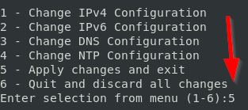
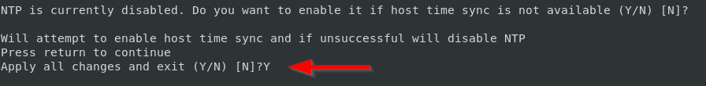

.. _avamar-server:

#############
Avamar Server
#############

Additional info: https://www.dell.com/support/home/en-us/product-support/product/avamar-virtual-edition/overview

Intro
=====
Avamar is data protection software sold by Dell EMC using the `NDMP <https://en.wikipedia.org/wiki/NDMP>`_
protocol. To work with OneFS, you must deploy both the Avamar Server and the
Avamar NDMP accelerator. This document covers the Avamar Server. For the NDMP
accelerator, checkout :ref:`avamar-ndmp`.

Getting Started
===============

Credentials
-----------
There is no default password for the WebUI of Avamar. Only the administrative interfaces
have a default password until you configure the server.

**SSH & MGMT** - ``root`` and ``changeme``
**WebUI** - ``root`` and there is not default password.

.. warning::

   Some parts of the Avamar web interface only works from inside your vLab network.
   To work around this bug in Avamar, connect to the web interface via a machine
   from inside your lab.

Configuring
-----------
This section goes over the initial configuration after deploying an Avamar server.
These directions **do not** describe how to configure OneFS to perform NDMP backups
to Avamar.

Creating an Avamar server
^^^^^^^^^^^^^^^^^^^^^^^^^
The only required values to create an Avamar server is the name for the new machine,
and an IPv4 address to configure the server to use. Here's an example of deploying
a new Avamar server, configured to use IP ``192.168.1.32``:

.. code-block:: shell

   $ vlab create avamar --name AVE --static-ip 192.168.1.32

Connecting to the management interface
^^^^^^^^^^^^^^^^^^^^^^^^^^^^^^^^^^^^^^
You have to connect to the management interface to setup the Avamar server.
To connect, run the following command replacing ``myAvamarServer`` with the literal
name of your server:

.. code-block:: shell

   $ vlab connect avamar --name myAvamarServer --protocol mgmt

Install Avamar software
^^^^^^^^^^^^^^^^^^^^^^^
That's right! You have to install the software after deploying the machine. Before
you can do that, you need to finalize the network configuration via SSH. To connect via SSH, run the following command, where ``<name>``
is replaced with the literal name of your machine:

.. code-block:: shell

   $ vlab connect avamar --name <name>

After logging in, press ``5`` to ``Apply changes and exit``:

Press enter at the next couple of prompts until you reach the ``Apply all changes and exit``
prompt. Then respond with ``Y`` (capitalized) and press enter:

After a few minutes, you'll be given a root shell. At this point, you can exit
the SSH interface.

Now you need to connect to the management interface. Run the following command,
replacing ``<name>`` with the literal name of your Avamar NDMP accelerator:

.. code-block:: shell

   $ vlab connect avamar --name <name> --protocol mgmt

After you've connected and logged into the management interface, click in the ``Install``
button to the right of the screen:

.. image:: mgmt_install.png

The nice part is that you only have to configure a couple of things. Everything
else is optional. To start, skip to the section to set the password for the WebUI:

.. image:: mgmt_skip_to_password.png

To make your life simpler, make sure to check the ``Use a common password`` box.
This is just a lab instance after all.

.. image:: mgmt_use_common_password.png

The last part is to set the timezone, so skip to the ``Server Settings`` section:

.. image:: mgmt_skip_to_server_settings.png

That's it! Just click "go" button (the button is not literally labeled "go") to start
the installation process. Now take a coffee break. It'll take some time for the installation
to complete.

.. _avamar-issues:

Known Issues
============
The OVAs shipped by Avamar are not perfect. Here's a list of known issues with by version:

19.3.0.149
----------
The Avamar NDMP accelerator is missing the AVP sofware package. You can obtain
a copy copy here: https://www.dell.com/support/home/en-us/product-support/product/avamar/drivers
Then upload the file to the system under ``/data01/avamar/repo/packages``.

19.4.0.116
----------
The Avamar Server is missing is missing the AVP sofware package. You can obtain
a copy copy here: https://www.dell.com/support/home/en-us/product-support/product/avamar/drivers
Then upload the file to the system under ``/data01/avamar/repo/packages``.
