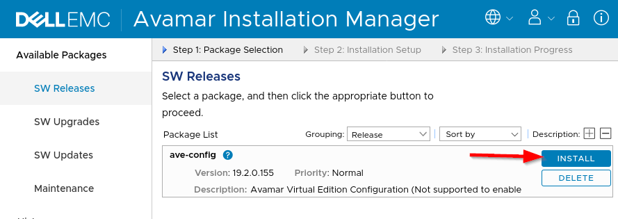
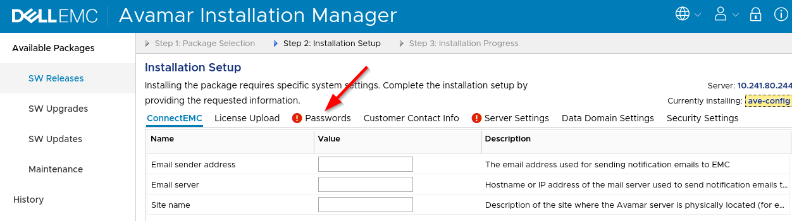
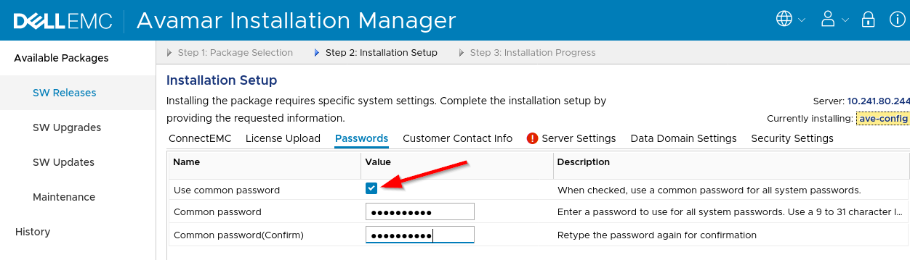
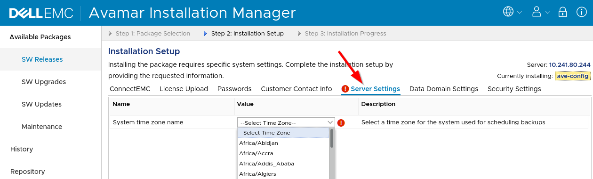

######
Avamar
######

Additional info: https://www.dell.com/support/home/en-us/product-support/product/avamar-virtual-edition/overview

Intro
=====
Avamar is data protection software sold by Dell EMC using the `NDMP <https://en.wikipedia.org/wiki/NDMP>`_
protocol.

Getting Started
===============

Credentials
-----------
There is no default password for the WebUI of Avamar. Only the administrative interfaces
have a default password until you configure the server.

**SSH & MGMT** - ``root`` and ``changeme``
**WebUI** - ``root`` and there is not default password.

.. warning::

   Some parts of the Avamar web interface only works from inside your vLab network.
   To work around this bug in Avamar, connect to the web interface via a machine
   from inside your lab.

Configuring
-----------
This section goes over the initial configuration after deploying an Avamar server.
These directions **do not** describe how to configure OneFS to perform NDMP backups
to Avamar.

Creating an Avamar server
^^^^^^^^^^^^^^^^^^^^^^^^^
The only required values to create an Avamar server is the version you want, and
an IPv4 address to configure the server to use. Here's an example of deploying
version ``19.2.0.155b`` and using IP ``192.168.1.32``:

.. code-block:: shell

   $ vlab create avamar --name AVE --image 19.2.0.155b --static-ip 192.168.1.32

Connecting to the management interface
^^^^^^^^^^^^^^^^^^^^^^^^^^^^^^^^^^^^^^
You have to connect to the management interface to setup the Avamar server.
To connect, run the following command replacing ``myAvamarServer`` with the literal
name of your server:

.. code-block:: shell

   $ vlab connect avamar --name myAvamarServer --protocol mgmt

Install Avamar software
^^^^^^^^^^^^^^^^^^^^^^^
That's right! You have to install the software after deploying the machine. Fun, right?
After you login to the management interface, click on the ``Install`` button:

The nice part is that you only have to configure a couple of things. Everything
else is optional. To start, skip to the section to set the password for the WebUI:

To make your life simpler, make sure to check the ``Use a common password`` box.
This is just a lab instance after all.

The last part is to set the timezone, so skip to the ``Server Settings`` section:

That's it! Just click "go" button (the button is not literally labeled "go") to start
the installation process. Now take a coffee break. It'll take some time for the installation
to complete.
