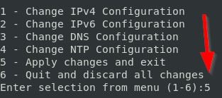
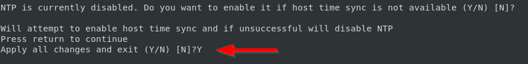
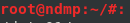
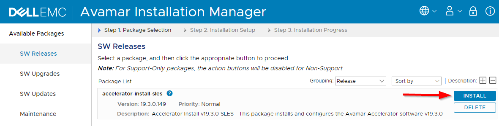
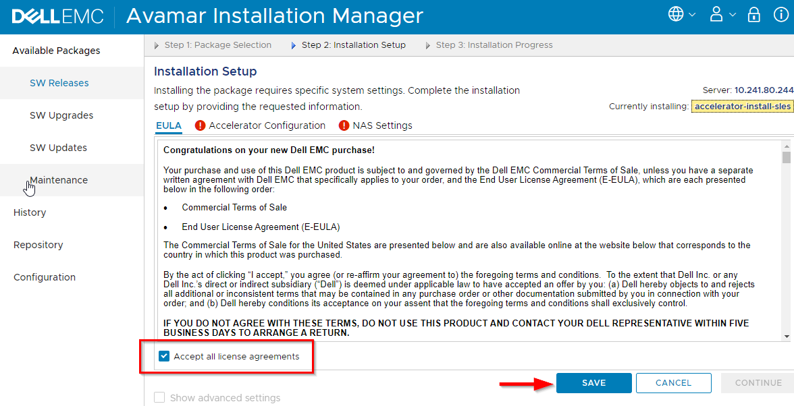
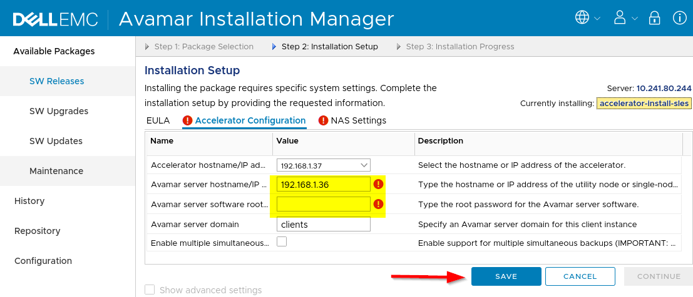
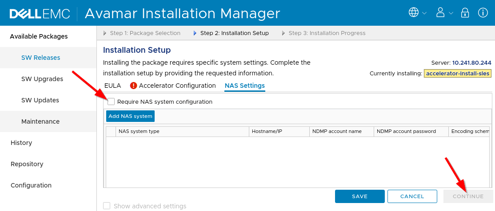

.. _avamar-ndmp:

#######################
Avamar NDMP accelerator
#######################

Additional Info: https://www.dell.com/support/home/en-us/product-support/product/avamar/overview

Intro
=====
The Avamar NDMP accelerator is used to backup and restore data residing on NAS systems.
The NDMP accelerator is able to translate the NDMP protocol used by NAS systems
for reading and writing data, to the Avamar server.

Credentials
-----------
The default credentials for the Avamar NDMP accelerator are:

**SSH & MGMT** - ``root`` and ``changeme``

Configuring
-----------
This section goes over the initial configuration after deploying an Avamar NDMP
Accelerator.

.. warning::

   You must have a deployed Avamar Server to complete the inital configuration
   of the NDMP accelerator.

.. note::

   The Avamar NDMP Accelerator User Guide contains directions for adding NAS
   systems after the initial configuration.

Creating an Avamar NDMP accelerator
^^^^^^^^^^^^^^^^^^^^^^^^^^^^^^^^^^^
The only required values to create an Avamar server is the name for the new machine,
and an IPv4 address to configure the server to use. Here's an example of deploying
a new Avamar server, configured to use IP ``192.168.1.33``:

.. code-block:: shell

   $ vlab create ana --name ndmp --static-ip 192.168.1.33

Connecting to the management interface
^^^^^^^^^^^^^^^^^^^^^^^^^^^^^^^^^^^^^^
You have to connect to the management interface to setup the Avamar NDMP accelerator.
To connect, run the following command replacing ``ndmp`` with the literal
name of your server:

.. code-block:: shell

  $ vlab connect ana --name ndmp --protocol mgmt

Installing the NDMP accelerator software
^^^^^^^^^^^^^^^^^^^^^^^^^^^^^^^^^^^^^^^^
The OVAs provided by Avamar come with an AVP package that contain all the software
needed to convert a Linux machine into an NDMP accelerator.

Before connecting to the management interface, you must connect via SSH and confirm
the network settings. To connect via SSH, run the following command, where ``<name>``
is replaced with the literal name of your machine:

.. code-block:: shell

   $ vlab connect ana --name <name>

After logging in, press ``5`` to ``Apply changes and exit``:

Press enter at the next couple of prompts until you reach the ``Apply all changes and exit``
prompt. Then respond with ``Y`` (capitalized) and press enter:

After a few minutes, you'll be given a root shell. At this point, you can exit
the SSH interface.

Now you need to connect to the management interface. Run the following command,
replacing ``<name>`` with the literal name of your Avamar NDMP accelerator:

.. code-block:: shell

   $ vlab connect ana --name <name> --protocol mgmt

After you've connected and logged into the management interface, click in the ``Install``
button to the right of the screen:

Next, check the box to accept the EULA then click the ``Save`` button.

Now click on the tab labeled ``Accelerator Configuration`` and fill out the
form. Once done, click the ``Save`` button.

Finally, you have the option to configure which NAS systems the NDMP accelerator
will communicate with. If you want to skip this step, un-check the ``Require NAS system configuration``
box, then click ``Continue``

.. note::

   The Avamar NDMP Accelerator User Guide contains directions for adding NAS
   systems after the initial configuration.

After about 5 to 10 minutes, your Avamar NDMP accelerator should be ready for use!

Known Issues
============
Have a problem? Checkout the :ref:`avamar-issues`.
