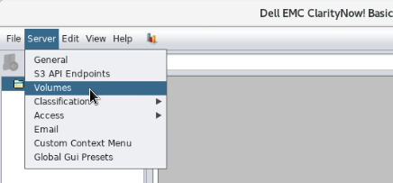

##########
ClarityNow
##########

`Website <https://www.dellemc.com/en-us/storage/data-storage/network-attached-storage/claritynow.htm#>`_

Product Page: https://support.emc.com/products/46438

Intro
=====
ClarityNow is data management software. It combines powerful filesystem analytics with
the ability to move data between different storage servers. With it's flexible
`showback <https://en.wikipedia.org/wiki/IT_chargeback_and_showback>`_ system
and granular permission controls, ClarityNow can be configured to allow *users*
of the storage to choose how much storage to consume, and where to locate it.

Getting Started
===============
Just about everything for ClairtyNow is located under ``/usr/local/claritynow``
on the server. This includes logs and config files.

.. note::

    Connect to the HTML console instead of RPDing into the ClarityNow server.
    For some reason, RPD doesn't fully render the application.

Credentials
-----------
The default password of ``a`` works for:

- ``root``
- ``administrator``

Deploying ClarityNow
--------------------
The ClarityNow image in vLab comes with everything already installed; simply
deploy an instance.

.. note::

  After your 60 days, your ClarityNow instance will stop working!
  The license we have for ClarityNow is only good for 60 days.

Mounting servers for scanning
-----------------------------
To collect the needed meta data that powers the analytics in ClarityNow, you
have must:

1. Mount the specific filesystem you want to scan
#. Add the volume (i.e. filesystem from step 1) to ClarityNow
#. Run a scan job

The following examples demonstrates how to mount the default share/export of
``/ifs`` on a OneFS cluster.

.. note::

   You can use the ``mount`` command to list all currently mounted filesystems,
   regardless of the protocol.

Mount an NFS export
^^^^^^^^^^^^^^^^^^^
That's right, don't call an *NFS export* an *NFS share*; you'll sound like a
novice ;)

Adding an NFS export to a Linux machine is very simple (assuming you haven't
forgotten to install the ``nfs-utils`` package).

**Step 1 - Create the local mount point**

The local mount point is how your server knows where *it's* file system stops,
and the remote filesystem begins.

Run this command, but feel free to change ``my-nfs-server`` with whatever you want;
it's your machine!

.. code-block:: shell

   $ sudo mkdir /mnt/my-nfs-server

**Step 2 - Test mounting the export manually.**

The syntax is like this:

.. code-block:: shell

   $ sudo mount -t nfs <ip of NFS server>:<path to export> <local mount point>

Assuming your NFS server is a OneFS cluster with an IP of ``192.168.1.20``, and
you're using the local mount point of ``/mnt/my-nfs-server``, the command will look like:

.. code-block:: shell

   $ sudo mount -t nfs 192.168.1.20:/ifs /mnt/my-nfs-server

If the mount fails, you'll see error message(s) written to the screen. You'll have to
debug that (aka google) before moving on.

To manually unmount the export run a command like this:

.. code-block:: shell

   $ sudo umount -l /mnt/my-nfs-server

**Step 3 - Add the mount to the /etc/fstab file.**

The `/etc/fstab <https://help.ubuntu.com/community/Fstab>`_ file is read on system
boot to mount all file systems. Because ClarityNow only needs to read the files,
we can use some handy `mount options <https://linux.die.net/man/5/nfs>`_ like
``soft`` and ``ro``!

Again, assuming your using a OneFS cluster with an IP of ``192.168.1.20`` the
line you need to add to ``/etc/fstab`` will look like this:

.. code-block:: shell

   192.168.1.20:/ifs /mnt/my-nfs-server nfs defaults,rsize=8192,noexec,nosuid,soft,ro 0 0

To test the syntax of your ``/etc/fstab`` file, simply run:

.. code-block:: shell

   $ sudo mount -a

The ``-a`` argument means *mount all the things* noted in ``/etc/fstab``.

Mount SMB a (aka cifs) share
^^^^^^^^^^^^^^^^^^^^^^^^^^^^
Mounting an SMB share is a bit more tricky because you have to define what credentials
to use when access the share. Beyond that, it's basically the same as using NFS.

**Step 1 - Create the local mount point**

The local mount point is how your server knows where *it's* file system stops,
and the remote filesystem begins.

Use the `mkdir <https://linux.die.net/man/1/mkdir>`_ command to create a new
directory under ``/mnt``:

.. code-block:: shell

   $ sudo mkdir /mnt/my-smb-server

**Step 2 - Create a credentials file**

.. warning::

   **DO NOT** store a username & password in ``/etc/fstab``; that file can be ready
   by all users of the system!

Use the `vi <https://linux.die.net/man/1/vi>`_ command to create the file like this:

.. code-block:: shell

   $ sudo vi /root/my-smb-server.creds

The contents of the should look like this (replace ``<some-password>`` and ``<some-user>``
with the actual username and password to use when accessing the SMB share):

.. code-block:: shell

   username=<some-user>
   password=<some-password>

If you were going to use ``root`` and that account had a password of ``a``, the
file would look exactly like this:

.. code-block:: shell

   username=root
   password=a

**Step 3 - Test manually mounting the share**

The syntax to mount the export is:

.. code-block:: shell

   $ sudo mount -t cifs //<server>/<share name> <local mount point> -o credentials=<path to creds>,ro

Assuming you're mounting ``ifs`` from a OneFS cluster with IP ``192.168.1.20``
to ``/mnt/my-smb-server`` and the file with login credentials file is located at
``/root/my-smb-server.creds``, the syntax would be:

.. code-block:: shell

   $ sudo mount -t cifs //192.168.1.20/ifs /mnt/my-smb-server -o credentials=/root/my-smb-server.creds,ro

Failure to mount the share will generate errors, so you'll have to resolve those
(i.e. google ``centos samba <the error>``) before proceeding.

Once you've mounted the share and verified that you can read some files from
it, unmount it with this command:

.. code-block:: shell

   $ umount -l /mnt/my-smb-server

**Step 4 - Add the share to /etc/fstab**

ClarityNow only needs to read the files on the SMB server, so we should use some
handy `cifs mount options <https://linux.die.net/man/8/mount.cifs>`_ to limit
access from the client side.

If your SMB server is a OneFS cluster with an IP of ``192.168.1.20``, you're
mounting default share of ``ifs`` to ``/mnt/my-smb-server``, and the credentials
file is located at ``/root/my-smb-server.creds``, the line to add in the
`/etc/fstab <https://help.ubuntu.com/community/Fstab>`_  file would look exactly
like this:

 .. code-block::

    \\192.168.1.20\ifs /mnt/my-smb-server cifs user,ro,soft,credentials=/root/my-smb-server.creds 0 0

Adding Volumes to ClarityNow
----------------------------
After you've mounted a filesystem to the ClairtyNow server, you must add it
as a volume to the application in order to collect meta data for reports.

To start, click on the ``Server`` menu tab, then select ``Volumes`` from the drop down:

This will open the ``Volumes`` view. Click on the three-disk icon to the left
labled ``Add volume`` (or press the ``F`` key; it's a shortcut):

On the new pop-up, you only have to provide a name and the mount point.

.. warning::

  Make sure **VFS** is selected for the ``FS Type``. Other options exist, but
  trust me, don't use them.

That's it! Now you should see your newly added volume in the navigation field
on the left-side of the application:

Scanning and Running Reports
----------------------------
With the volume(s) now added to ClarityNow, you can start scan jobs to collect
meta data and generate some reports!

It's pretty simple to start a scan job. Start by right-clicking on the specific
volume, then select the ``Scan selected`` option from the menu:

Now, we wait! The job is going to walk the entire filesystem to collect meta data,
so the larger the volume, the longer it will take.

You can view the status of the scan job by clicking on the bottom-right corner
of the application. It'll bring up a view of the scan jobs, and their status:

.. image:: scan_volume_status.png
   :scale: 50 %

Once the scan job has completed, if you click on the volume from the navigation
menu on the left-side of the application window, you'll see some information
about the data on that volume!

From here, you can select different reports to run from the ``View`` tab, leverage
the search field to find files, and so much more!
