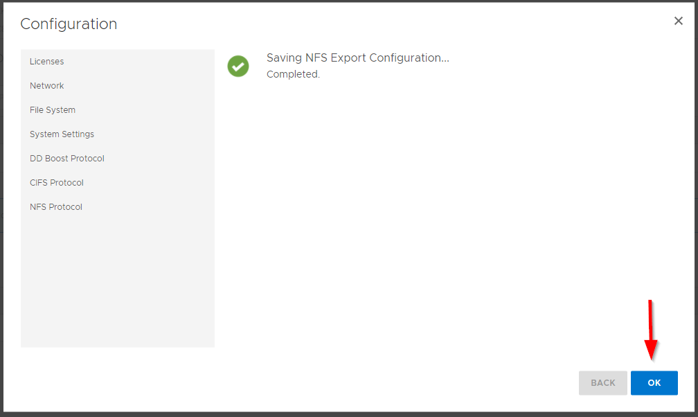

###########
Data Domain
###########

Additional documentation: https://www.dell.com/support/home/en-us/product-support/product/data-domain/overview

Intro
=====
Data Domain is a data deduplication and compression server. This enables a Data
Domain to store a large amount of information using less disk space, which makes
it an ideal target for backing up the data from other servers.

Getting Started
===============

Credentials
-----------
The default password is only valid until you configure the system. Part of the
configuration process is setting a new password.

The admin account for Data Domain is ``sysadmin`` with a default password of ``changeme``.

Configuring
-----------
This section goes over deploying a Data Domain server, and some minimal steps
to configure the system for use.

.. note::

   The web interface can take 10 minutes to become available after initial deployment.
   If you get a connection error upon connecting to the web interface upon first
   connecting to a new Data Domain server, wait 10 minutes then refresh the web page.

Creating a Data Domain server
^^^^^^^^^^^^^^^^^^^^^^^^^^^^^
The only required value to create a new Data Domain server is its name. Here's
and example creating a server named ``mydd``:

.. code-block:: shell

   $ vlab create dd --name mydd

Initial configuration
^^^^^^^^^^^^^^^^^^^^^
You can configure a Data Domain server via the CLI or the web interface. These
directions are specific to using the web interface (yay pictures).

Once you've created the Data Domain server, connect to the web interface with this
command, replacing ``mydd`` with the name of your Data Domain server:

.. code-block:: shell

   $ vlab connect dd --name mydd

Once the web page loads, login:

Upon logging into the Data Domain server for the first time, you'll be forced to
changed the default password:

.. image:: 2_set_password.png

After setting the password, you'll be presented with the EULA. Click ``Accept``:

At this point, you should see the initial configuration wizard. For the license,
just skip it. Data Domain servers come with a trial license that's valid for 45 days:

For the network, just skip this too. You can always change the network configuration
later:

Click ``yes`` on this page to setup the filesystem:

Now, check the box next to the ``dev3`` device, then click ``Add to tier``:

After a moment, the page should update and look similar to the below screen shot.
Click the ``Next`` button:

Skip the Cloud Tier configuration section by clicking ``Next``:

Because this is not a production system, click the ``Skip Assessment`` button:

Finally, click the ``Submit`` button to complete the initial filesystem configuration:

After a couple of minutes, the filesystem will be configured. Click ``OK`` to continue
onto the next section:

For now, skip configuring additional system settings:

And skip setting up DD Boost:

OK, time to setup CIFS (i.e. support for Windows clients)! Start by clicking
``yes``:

And just click the ``Next`` button unless you know what you're doing:

Now, enter any name you want for the share. In the below image, the share is named
``dd``, but feel free to set it to something different. Below that, you **MUST**
enter ``/data/col1/backup``. That's the default location for files that's created
when the filesystem was setup.

If you already know the IPs of the CIFS clients you liked to access the Data Domain
server, click the plus button (``+``) and enter that information.

One the form is filled out, click ``Next``:

Last, but not least, click the ``Submit`` button to complete the CIFS configuration:

After a couple of minutes, the configuration will complete. Once it's completed,
click ``OK`` to move onto setting up NFS:

Almost done! Last thing to configure is NFS. Begin by clicking the ``yes`` button:

Similar to the CIFS configuration, you have to provide a name and a path for the
NFS export. Enter any name you'd like. This example names the NFS export ``backup``.
And just like CIFS, the path value **MUST** be ``/data/col1/backup``. If you know
the IPs of NFS clients you'd like to have access to this NFS export, click the
plus (``+``) button and fill out the form.

Once complete, click the ``Next`` button:

Now click the ``Submit`` button to complete the NFS configuration:

After a few minutes, the configuration process will be complete. Click the ``OK``
button to finish the inital configuration and exit the wizard:

That's it! Your Data Domain server is ready for both Windows and Linux clients!
