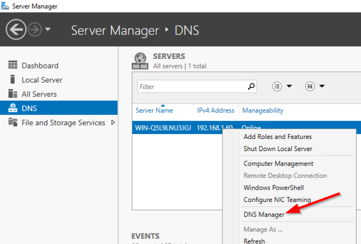
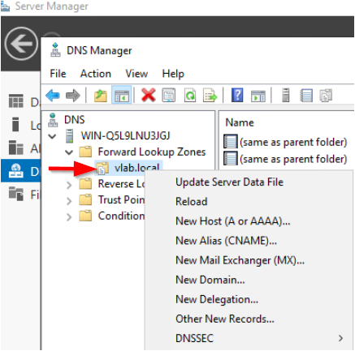
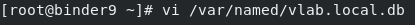
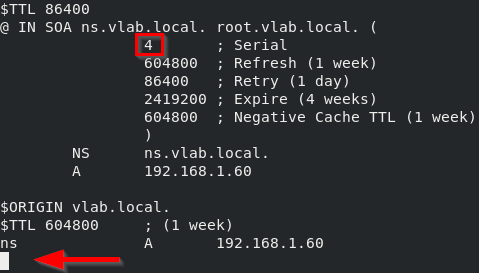
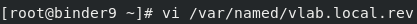
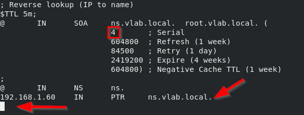
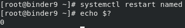

###
DNS
###

Domain Name System - `wiki <https://en.wikipedia.org/wiki/Domain_Name_System>`_

Intro
=====
Unlike other components that you can deploy in vLab, the DNS server is a more
generic piece of infrastructure. This server allows you to map human-friendly
names to computer network addresses **inside** your lab. Accessing a DNS server
deployed in vLab from an external devices is strictly limited to the server's
`management plane <https://en.wikipedia.org/wiki/Management_plane>`_. In simpler
terms, you cannot have your laptop/workstation use a DNS server in your lab for
resolving names to IP addresses.

Getting Started
===============
You have access to the two most common types of DNS servers used in the world:

- `Windows DNS <https://docs.microsoft.com/en-us/windows-server/networking/dns/dns-top>`_
- `Bind9 <https://www.isc.org/bind/>`_

How you configure both of these systems is vastly different. As such, the documentation
(including default credentials) is define in their respective sections. What is
identical between these two flavors of DNS servers is the default realm: ``vlab.local``.

The most common types of records you'll probably make in your DNS server are:

- `A <https://support.dnsimple.com/articles/a-record/>`_
- `AAAA <https://www.wpoven.com/blog/need-know-aaaa-record/>`_
- `CNAME <https://support.dnsimple.com/articles/cname-record/>`_
- `NS <https://support.dnsimple.com/articles/ns-record/>`_
- `PTR <https://en.wikipedia.org/wiki/Reverse_DNS_lookup>`_

However, there are `a lot more <https://en.wikipedia.org/wiki/List_of_DNS_record_types>`_
kinds of valid DNS records.

Windows DNS Server
==================
Most corporations use Windows DNS as part of their Active Directory deployment.

Credentials
-----------
The default login credentials for Windows DNS deployed in vLab are:

- Username - ``Administrator``
- Password - ``a``

Creating some record
--------------------
From the Windows Server Manger, click on ``DNS`` in the left menu. Now, right-click
on your server in the main window, and select ``DNS Manager``:

On the DNS Manager window, expand the ``Forward Lookup Zones`` folder and right-click
on the ``vlab.local`` item to choose the type of DNS record you want to create.

Now just follow the prompts to create your DNS record.

Bind9 DNS Server
================
Bind9 is the most popular open-source DNS server in the world, probably because BIND
was the first DNS server implementation ever. That's right, this thing is probably
older than you! :P

Credentials
-----------
The default login credentials for Bind9 DNS deployed in vLab are:

- Username - ``root``
- Password - ``a``

Creating some record
--------------------
This is going to be more work than Windows DNS.

First, you'll have to open for forward lookup file for editing:

Now you'll have to edit the file; new records go at the bottom.

.. note::

   Make sure to change the ``Serial`` value, otherwise your change will be ignored!

If you need to create a `PTR <https://en.wikipedia.org/wiki/Reverse_DNS_lookup>`_
record, open this file for editing:

Again, new records go at the bottom. And remember to change the ``Serial`` value
in this file too:

.. note::

   Don't forget the trailing dot (``.``) in your PTR record!

Now that all the record files have been edited, you have to restart the ``named``
service:

.. note::

  **ProTip** - The command ``echo $?`` prints the exit code of the previous command.
  A value of zero means the command was successful. Any other value indicates an error
  occured in the pervious command.
