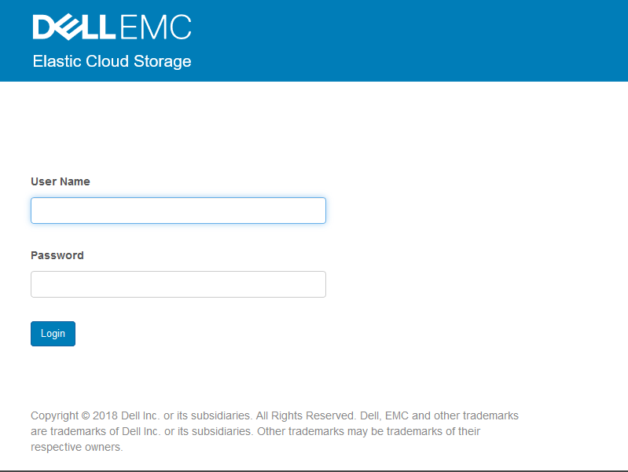
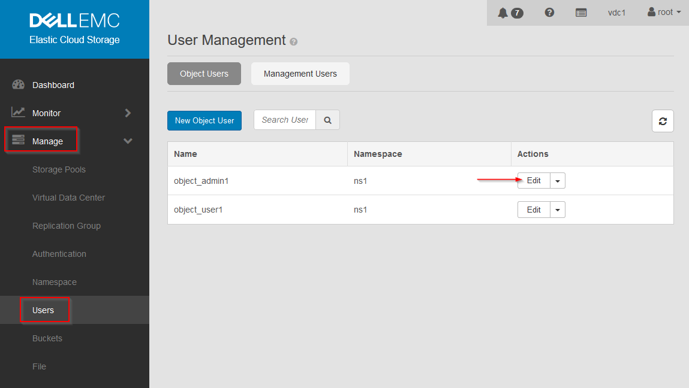
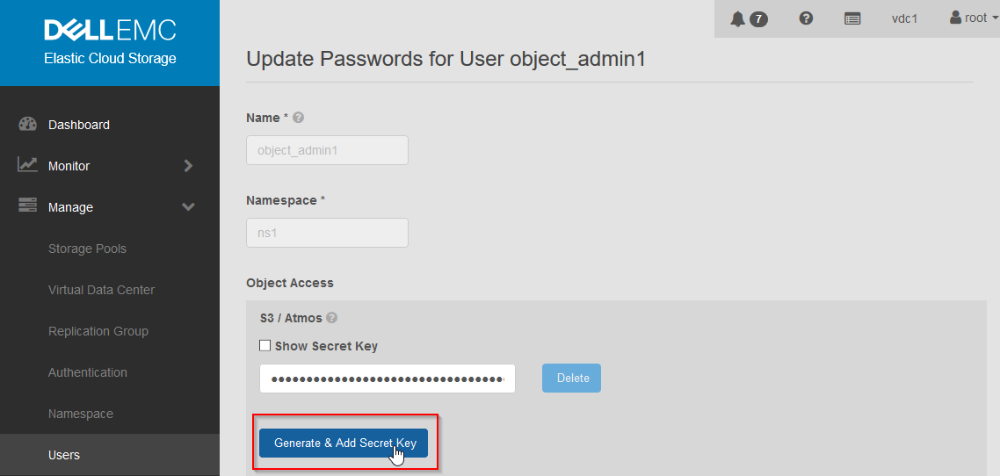
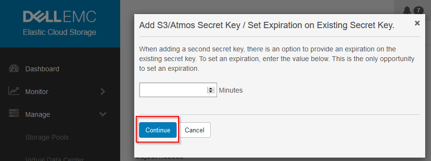
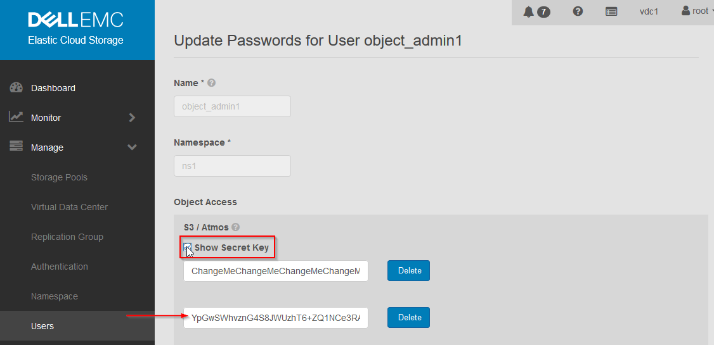
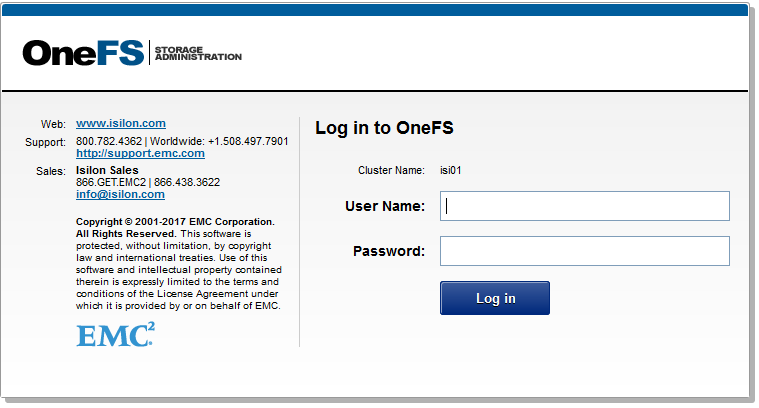
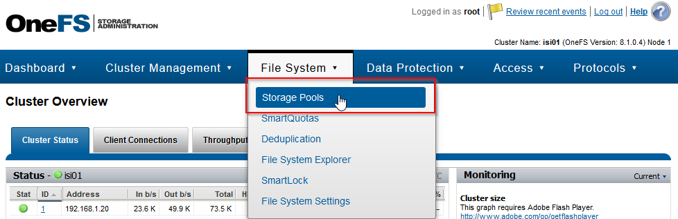
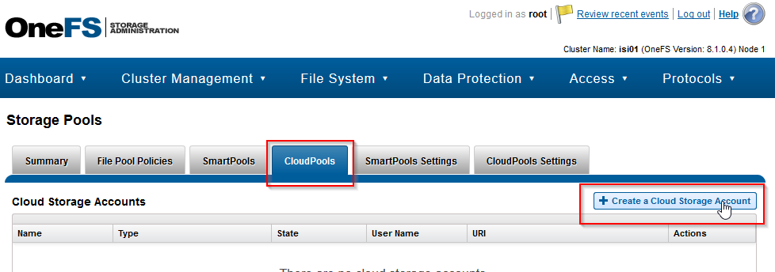
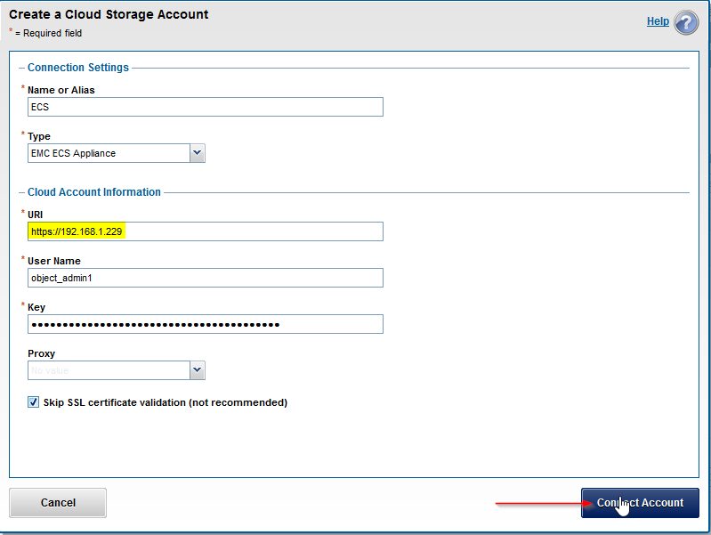

###
ECS
###

Website: https://support.emc.com/products/37254

Additional documentation: https://github.com/EMCECS/ECS-CommunityEdition

Intro
=====
Elastic Cloud Storage is a `stateful <https://en.wikipedia.org/wiki/State_(computer_science)>`_,
`containerized <https://www.redhat.com/en/topics/containers>`_,
`object storage <https://en.wikipedia.org/wiki/Object_storage>`_ system developed
by Dell EMC.

Getting Started
===============

Credentials
-----------
The default username and password for ECS is:

**SSH** - ``admin`` and ``ChangeMe``
**WebUI** - ``root`` and ``ChangeMe``

Configuring
-----------
This section goes over deploying ECS, and configuring OneFS to use it as a
CloudPools target.

Deploying ECS
^^^^^^^^^^^^^
By default, when you create an ECS instance vLab will *auto-magically* configure
the host CentOS 7 VM into a usable ECS appliance. To deploy a new instance of
ECS running version 3.2.0.0, run a command like this:

.. code-block:: shell

   $ vlab create ecs --name myECS --image 3.2.2.0

If you'd like the *"joy"* of figuring out how to bootstrap ECS onto a CentOS 7
VM yourself, opt-out of the vLab magic with the ``--skip-config`` flag.

Obtaining the ECS key
^^^^^^^^^^^^^^^^^^^^^
OneFS requires a secret key to archive files to ECS. These directions will show
you how to find that key on your ECS instance.

1) Login to the ECS WebUI

.. note::
  Upon first login of the ECS WebUI, it'll prompt you to set a new password.
  The SSH password and WebUI password are not kept in sync. Therefore, when you
  change one password, you should **also** change the other to match.

2) Navigate to Mange > Users > ``object_admin1``

3) Generate a new secret key

4) Set the expiration time, or leave blank so the key never expires

5) Copy/note the new key after checking the ``Show Secret Key`` check-box

Configuring ECS as a CloudPools target
^^^^^^^^^^^^^^^^^^^^^^^^^^^^^^^^^^^^^^
Before you can configure ECS as a CloudPools target, you must obtain a secret
key from ECS and the IP of the VM *inside* your lab.

**OneFS CLI**

Once you have the ECS secret key, the simplest way to configure OneFS to use
the CLI. Replace ``<KEY>`` and ``<ECS IP>`` with the specific key and IP of the
ECS instance in your lab:

.. code-block:: shell

   $ isi cloud accounts create --type=ecs --name=ecs --account-username=object_admin1 --uri=https://<ECS IP>:9021 --key=<KEY> --skip-ssl-validation=true

**OneFS WebUI**

If you prefer to use the OneFS WebUI, then:

1) Login to the OneFS WebUI

2) Navigate to the Storage Pools page

3) Click on the ``CloudPools`` tab, then ``Create a Cloud Storage Account``

4) And finally, fill out the form

.. note::
   Remember to replace the highlighted section with the IP of *your* ECS instance
