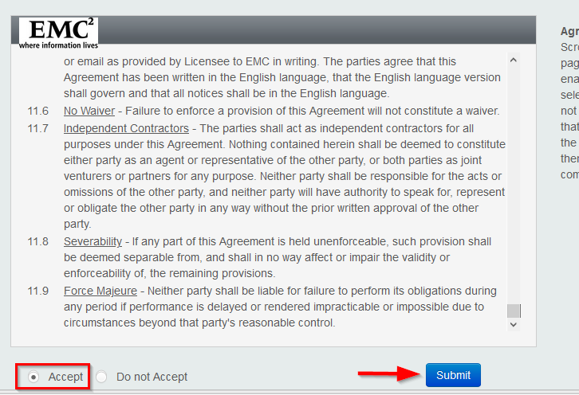
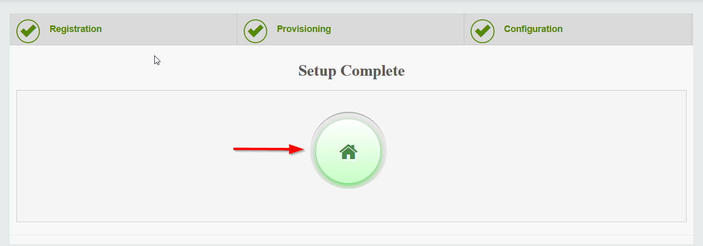

######
[E]SRS
######

Website: https://www.dell.com/support/home/en-us/product-support/product/emc-secure-remote-services-virtual-edition/overview

.. warning::

   You need a valid license for OneFS 8.1.0 and newer to connect a cluster to ESRS.
   The trial license will not work.

Intro
#####
Secure Remote Services (formerly ESRS) is a secure, two-way connection between
Dell EMC products and Dell EMC Customer Support that helps customers avoid and
resolve issues up to 73% faster1. It is completely virtual and offers flexibility
for enterprise environments of any size.

Getting Started
###############

Credentials
===========
The default username and password for [E]SRS is:

**SSH** ``root`` and ``a``

**WebUI (first-time login)** ``root`` and ``a``

**WebUI** ``admin`` and you have to set a custom password

.. note::

   Logging into the WebUI as ``root`` is only valid for the first login.
   Part of the configuration of [E]SRS is setting up the ``admin`` account
   for subsequent logins.

Configuring
===========

Deploying [E]SRS
----------------

1. Update [E]SRS
^^^^^^^^^^^^^^^^
After you've deployed an instance of [E]SRS, connect to it via SSH and run:

.. code-block:: shell

   /opt/esrsve/vappconfig/update.sh

.. note::

   The machine will reboot, and you'll lose your SSH connection. This is expected.
   Please be patient while the machine reboots; it take several minutes.

2. Login to the WebUI
^^^^^^^^^^^^^^^^^^^^^
Click the ``Login`` button in the upper right of the web page:

And login with the **WebUI (first-time login)** username and password (``root`` and ``a``).

3. Accept the EULA
^^^^^^^^^^^^^^^^^^
Scroll to the bottom of the EULA, check the ``Accept`` box and click ``Submit``:

4. Set a password for ``admin``
^^^^^^^^^^^^^^^^^^^^^^^^^^^^^^^
Now you have to configure a custom password for the ``admin`` account:

.. note::

   After setting the password, the next page might appear to hang. Just be patient;
   it'll finish loading.

5. Register Contacts
^^^^^^^^^^^^^^^^^^^^
Fill out Primary Contact information, and then click the submit button in the
lower right:

Skip the technical contact page by clicking this button:

6. Provision [E]SRS
^^^^^^^^^^^^^^^^^^^
Skip configuring a proxy by clicking ``Network Check`` in the upper left:

You **must** run the network test before being able to continue:

On this page, you need to enter **your** RSA credentials:

Finally, enter ``1004556575`` for the Site ID:

Once the Site ID is accepted and you click the ``Next`` button, the [E]SRS
server will go through the provision process. This can take several minutes
to complete.

7. Configure Email
^^^^^^^^^^^^^^^^^^
Enter **your** work email address, in the ``Notification Email(s)`` section.
Use the following for the remaining required fileds:

Server - ``mailhub.lss.emc.com``

Port   - ``25``

Sender Email: ``noreply@dell.com``

.. note::

   If you get an error when configuring email, just skip it.

8. Complete Setup
^^^^^^^^^^^^^^^^^
Skip to the ``Connect Home`` page by clicking:

And click the ``Complete setup`` button:

Your [E]SRS instance is now ready for use! You can click on the Dashboard
button, which will take you back to the login page:

.. note::

   You'll have to login with the ``admin`` and custom password you created
   to access the dashboard.
