####
ESXi
####

Website: https://www.vmware.com/products/esxi-and-esx.html

Additional documentation: https://docs.vmware.com/en/VMware-vSphere/index.html

Intro
=====
VMware ESXi is a hypervisor, which is a fancy way to say,
*"It's a operating system that can run other operating systems as if they were applications."*

Getting Started
===============
This section will help you get started using ESXi in vLab.

Why!?
-----
If vLab deploys virtual machines, why would anyone need to deploy ESXi?
Great question! Here's a few reasons:

* vLab doesn't have the `OS <https://en.wikipedia.org/wiki/Operating_system>`_ you need/want
* You need to test some interaction between VMware's software, and something else
* You want to learn about VMware

Credentials
-----------
The default username and password for ESXi in vLab is ``root`` and ``a``.

Deploying a custom ISO
----------------------
This section will go over how to upload a custom ISO and create a new VM via
the ESXi web-based interface. This is only **one** example of how to do this;
like most things there are many other ways to perform the same task.

For more information about VMware, checkout `their documentation <https://docs.vmware.com/en/VMware-vSphere/index.html>`_.

1) Login
^^^^^^^^
After you've downloaded the specific ISO to your laptop, connect to the ESXi
management interface using the credentials mentioned above.

(**Protip**: The ``vlab connect esxi --name <name>`` command will do this for you).

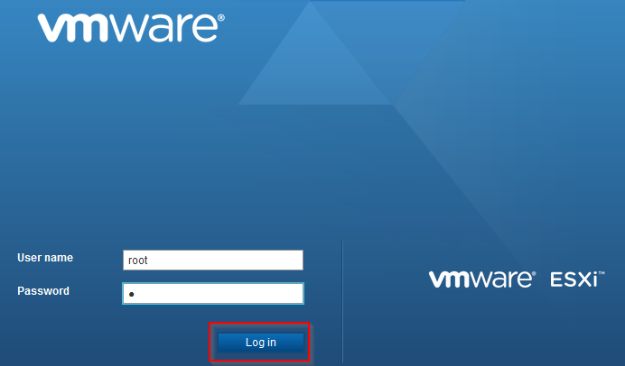

2) Open Datastore
^^^^^^^^^^^^^^^^^
To upload your specific ISO to the ESXi host, right-click on **Storage** in the
navigation plane on the left of the page, then click on **Browse datastore**:

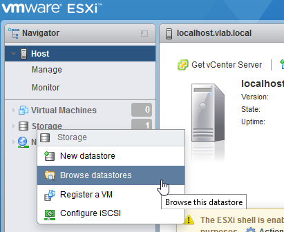

3) Upload ISO
^^^^^^^^^^^^^
On the **Browse datastore** pop-up, click the **Upload** button.
That will open up your laptop's file explorer enabling you to select the ISO saved
on your local laptop:

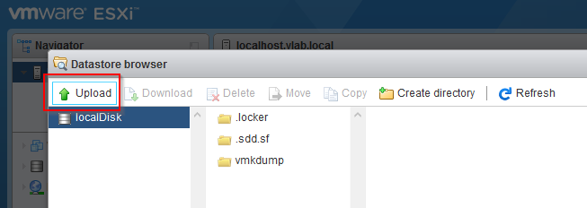

4) Upload Progress
^^^^^^^^^^^^^^^^^^
Once the ISO is select, you'll notice the upload progress in the upper right:

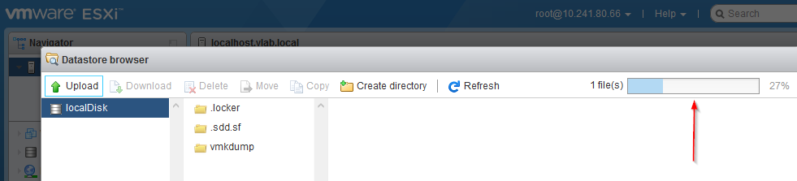

5) Create VM
^^^^^^^^^^^^
After the ISO has completed uploading, left-click on **Virtual Machines** to select
**Create/Register VM**:

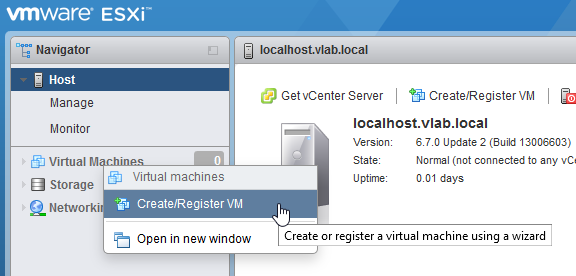

6) Create VM Wizard
^^^^^^^^^^^^^^^^^^^
On the New VM Wizard, making a brand new VM is the default. Simply click the **Next**
button:

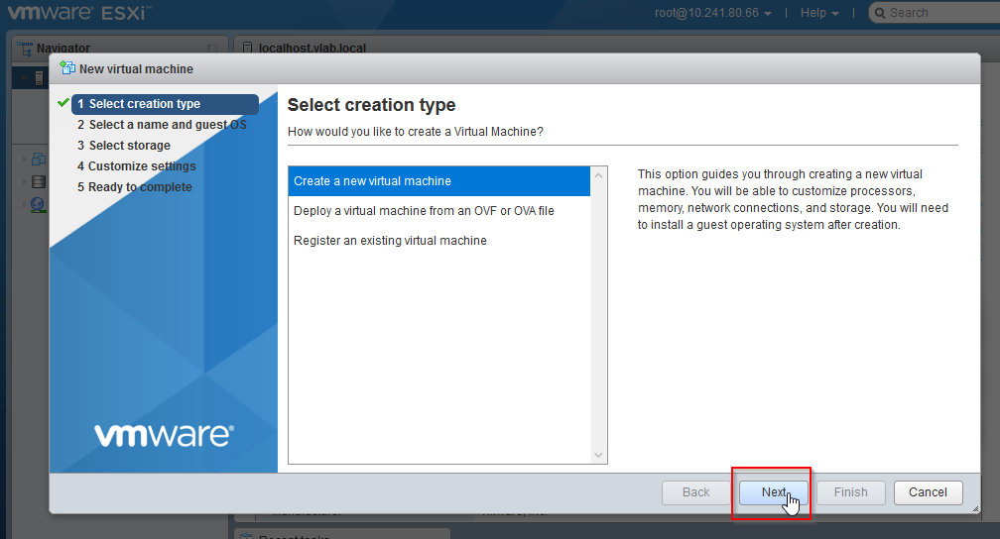

7) Create VM Name
^^^^^^^^^^^^^^^^^
On this page, the only required field is to provide your virtual machine with
a **Name**:

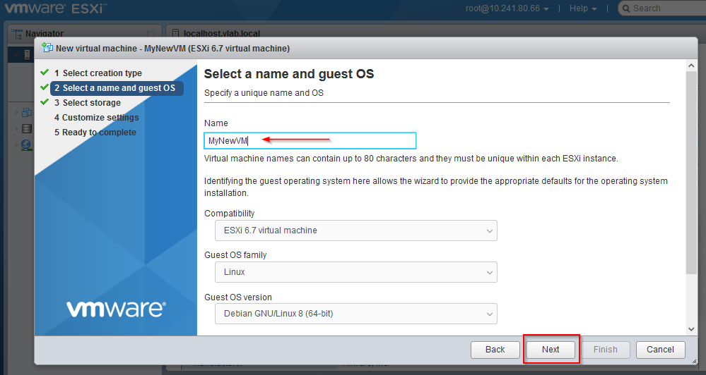

Feel free to fill out the other sections, or to simply click **Next** after naming
your new VM.

8) Create VM Storage
^^^^^^^^^^^^^^^^^^^^
By default, the **localDisk** option will be selected. Unless you've configured
a different storage option, just click the **Next** button:

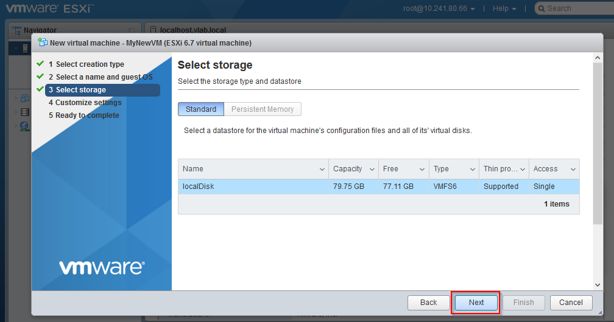

9) Create VM ISO
^^^^^^^^^^^^^^^^
This page allows you to configure the amount of *"hardware"* resources for your
new virtual machine. After adjust the amount of CPU, RAM and/or Disk, scroll down
to the **CD/DVD Drive 1** device and from the drop-down select **Datastore ISO file**:

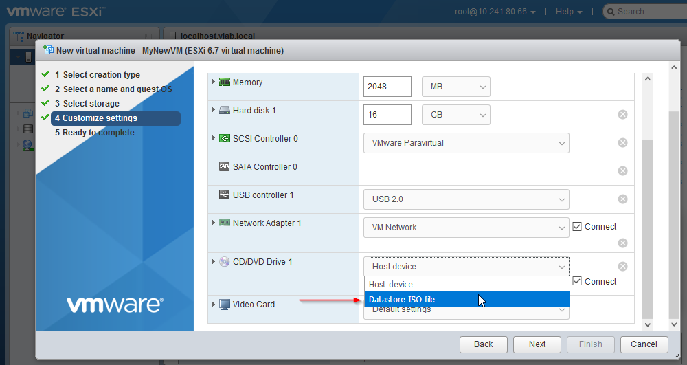

.. note::
   Make sure that the ``Connect`` box is checked for CD/DVD Drive 1

10) Create VM Select ISO
^^^^^^^^^^^^^^^^^^^^^^^^
This brings up the Datastore Browser (that thing from step 3). Find and **Select**
the ISO you uploaded:

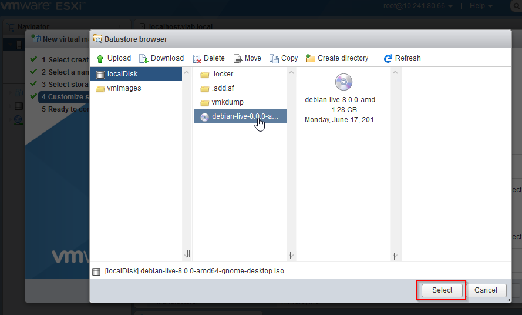

11) Create VM Finish
^^^^^^^^^^^^^^^^^^^^
The final page allows you to review the configuration of your new VM. Once you're
ready, click the **Finish** button to create the new virtual machine:

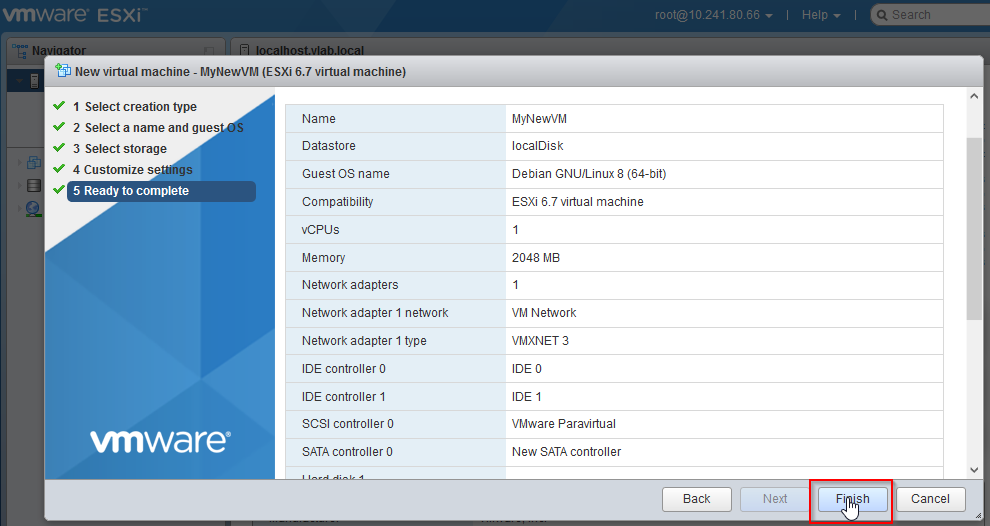

12) Find New VM
^^^^^^^^^^^^^^^
Clicking on the **Virtual Machines** item in the navigation bar opens up a view
to all the VMs on your ESXi host.

Once you've found the VM, simply click on it to open a VM-specific view:

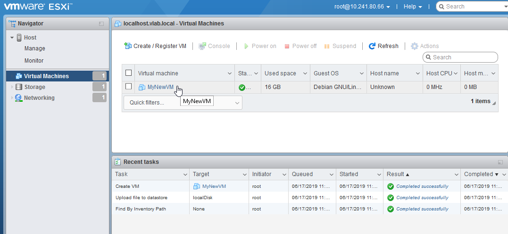

13) Power On VM
^^^^^^^^^^^^^^^
On the VM-specific view, click the **Power on** button to boot your new virtual machine:

.. image:: esxi_vm_power_on.png
   :scale: 50 %

14) Open VM Console
^^^^^^^^^^^^^^^^^^^
Once the VM boots, you'll be able to click on the console picture to connect to
it.

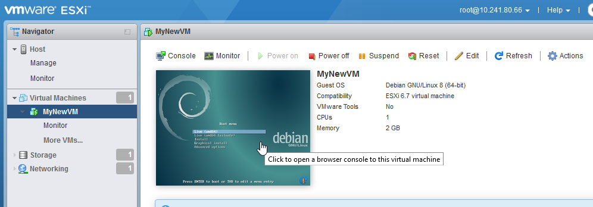

At this point, just install the OS as usual.
The network options for your new VM is **the same** as all the other machines
within your lab (like, the ones not running on a virtual ESXi host).
