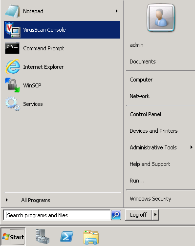
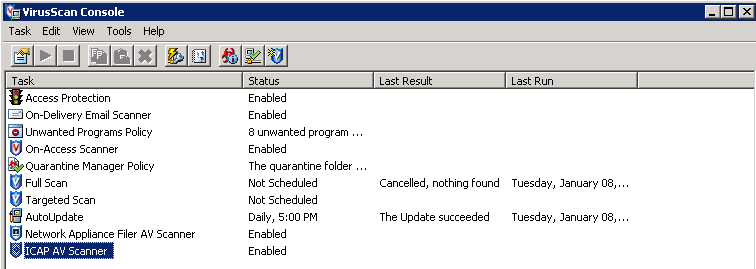
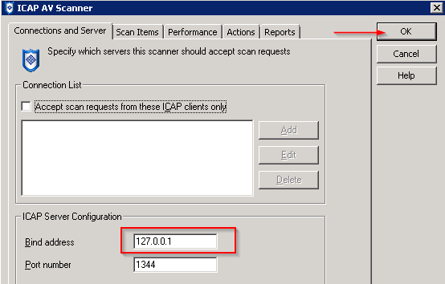
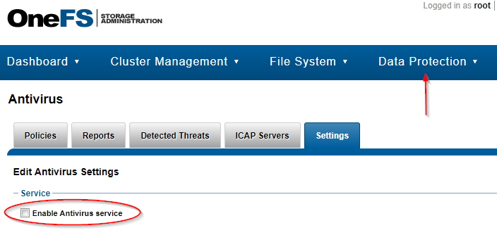
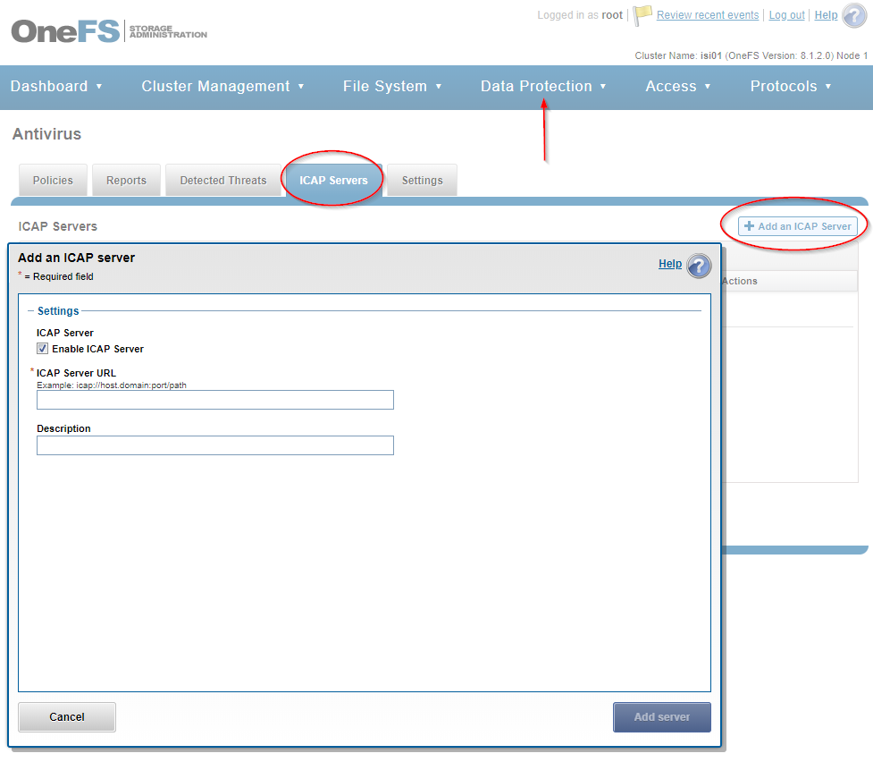

####
ICAP
####

Website: https://www.mcafee.com/enterprise/en-us/products/virusscan-enterprise-for-storage.html

Intro
=====
`ICAP <https://en.wikipedia.org/wiki/Internet_Content_Adaptation_Protocol>`_ is a
protocol built on top of `HTTP <https://en.wikipedia.org/wiki/Hypertext_Transfer_Protocol>`_.
In the context of vLab, ICAP represents a server used for scanning files for
viruses.

Getting Started
===============
This section will help you configure your ICAP server so clients can send it
files for virus scanning.

Credentials
-----------
The main users on the ICAP server are ``admin`` and ``administrator``. Both are
equal administrators, and exist to make the *"what user do I log in as..."* problem
easier to *guess and be correct.*

Configuring
-----------
When you're ICAP server is deployed, it will automatically have the software installed
and necessary licenses configured. However, there's still some additional configuration
**you must do** before clients can send your ICAP server files for virus scanning.

Initial system configuration
^^^^^^^^^^^^^^^^^^^^^^^^^^^^
The IP address that the server listens on must be configured. By default, the
server only listens over `127.0.0.1`. You must update this value to the DHCP
address of your server, and it's only a few steps:

1) Open the McAfee admin panel

2) Select ``ICAP AV Scanner``, right click on it, and select ``properties``

3) Update the IP, then click the ``OK`` button

That's it! Your ICAP server should now accept virus scan requests.

Configuring OneFS
-----------------
This section will walk you though configuring OneFS to use your new ICAP server.

Enable the AVScan service in OneFS
^^^^^^^^^^^^^^^^^^^^^^^^^^^^^^^^^^
The AVScan service can be enabled at the CLI or in the OneFS WebUI.

CLI
"""
To enable the service from the CLI, run the following command:

.. code-block:: shell

   # isi services -a isi_avscan_d enable

WebUI
"""""
To enable the service from the WebUI, navigate to Data Protection > Antivirus > Settings
and check the ``Enable Antivirus service``

Add the ICAP server
^^^^^^^^^^^^^^^^^^^
You can add ICAP servers to OneFS via the CLI or WebUI.

CLI
"""
To add an ICAP server from the CLI, the command will be like this:

.. code-block:: shell

   # isi antivirus servers create <IP of ICAP Server> --enabled true

Where ``<IP of ICAP Server>`` is replaced with the *literal* IP of your new ICAP server.

WebUI
"""""
In the WebUI, navigate to Data Protection > Antivirus > ICAP Servers and click
the ``Add an ICAP Server`` button:

Testing Configuration
^^^^^^^^^^^^^^^^^^^^^
OneFS allows you to manually scan a file, which is very handy for testing functionality.
The easiest way to manually scan a file is from the CLI with the following command:

.. code-block:: shell

   # isi antivirus scan /ifs/README.txt

If the scan fails, checking ``/var/log/isi_avscan_d.log`` will help debug the issue.
