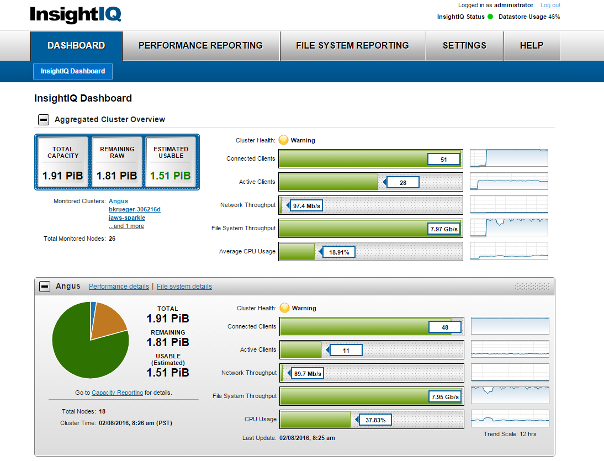
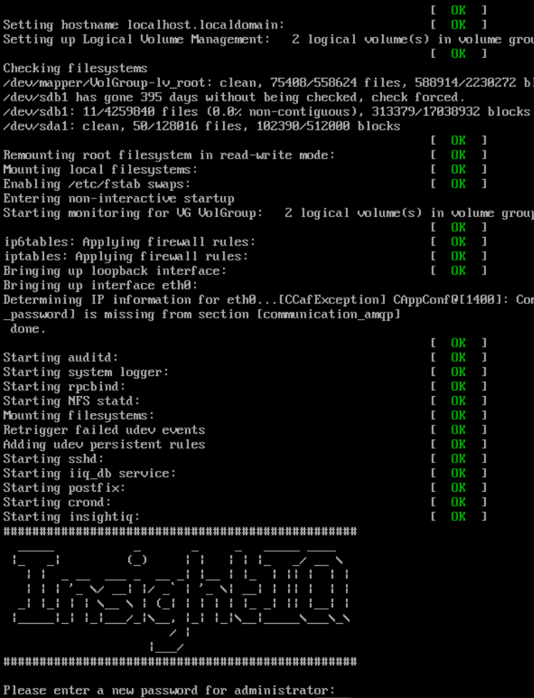
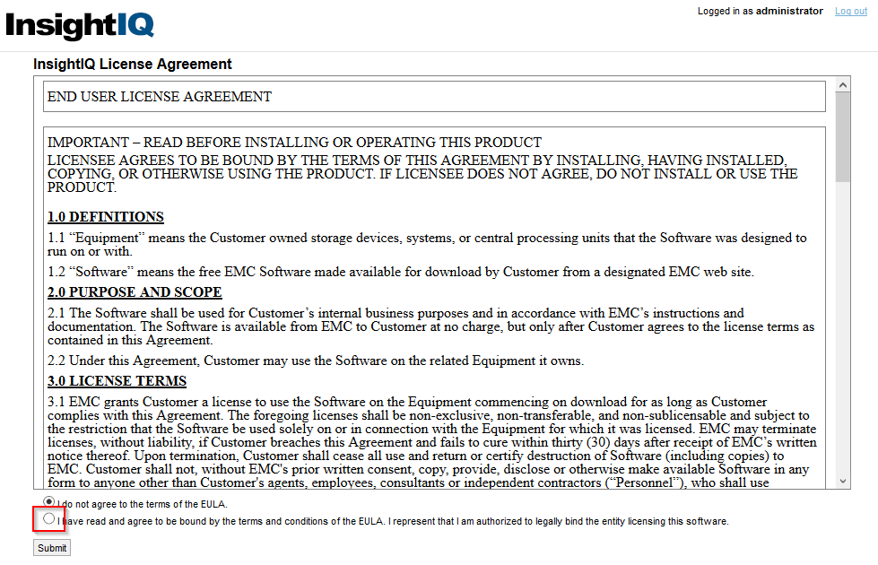
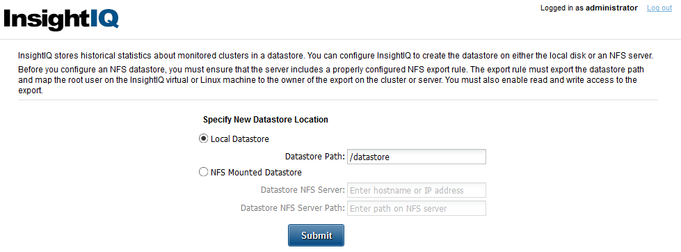
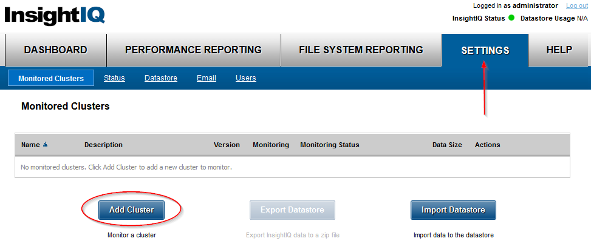

#########
InsightIQ
#########

Website: https://support.emc.com/products/15208

Intro
=====

InsightIQ is a web application that can generate useful reports about a OneFS
cluster. It runs on `Linux <https://www.linux.com/what-is-linux>`_ (i.e. *not* on OneFS),
is written in `Python <https://www.python.org/about/>`_, and uses
`PostgreSQL <https://www.postgresql.org/about/>`_ for it's database.

Here's what InsightIQ looks like:

Getting Started
===============
This section will help you start using InsightIQ once it's been deployed into
your lab.

Credentials
-----------
The main user in InsightIQ is ``administrator``.

The InsightIQ application collects data from OneFS via the ``insightiq`` user
on the monitored cluster.

Configuring
-----------
This section will guide you though setting InsightIQ for the first time. This
section is not exhaustive; there are *a lot* more features/functionality that
can be configure in InsightIQ. These directions are simply the basics steps
necessary to *get started* with InsightIQ.

Initial system configuration
^^^^^^^^^^^^^^^^^^^^^^^^^^^^
When you create InsightIQ, it will automatically obtain a
`DHCP <https://en.wikipedia.org/wiki/Dynamic_Host_Configuration_Protocol>`_
IP address. Once the VM is running, open the console to get started configuring
the system.

Here's an image of the console of InsightIQ 4.1:

Initial application configuration
^^^^^^^^^^^^^^^^^^^^^^^^^^^^^^^^^
Once you're finished walking through the configuration wizard on the console,
open a web page to InsightIQ with a ``vlab connect`` command like this:

.. code-block:: shell

    vlab connect insightiq --name <the name>

Where ``<the name>`` is replaced with the *literal* name you gave the machine when
creating it.

Upon logging into InsightIQ for the first time ever, you'll be prompted to accept
the EULA:

After that, you can choose *where InsightIQ stores its data*. The default of
``/datastore`` is a great choice, so simply click the submit button:

Adding a OneFS cluster
^^^^^^^^^^^^^^^^^^^^^^

To add a cluster in InsightIQ, open the Settings page and click the Add Cluster
button.

A small window will open and you'll have to input the FQDN or IP of the OneFS
cluster, along with a username and password. The standard user configures is
named ``insightiq``.

.. tip::
   The ``insightiq`` user in OneFS is not enabled by default. To enable that user,
   run the following command on the **OneFS** CLI: ``# isi auth users modify insightiq --enabled true --set-password``
