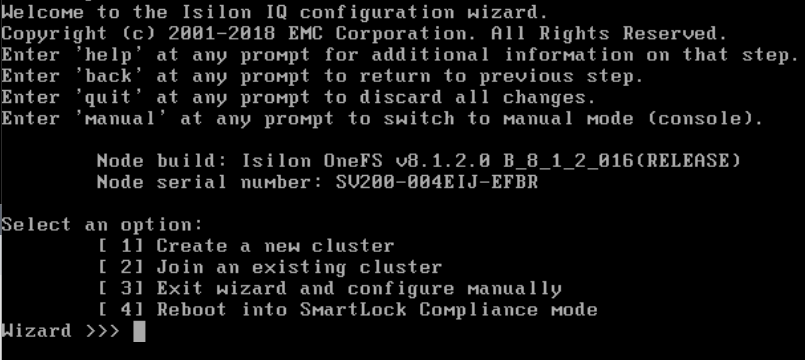
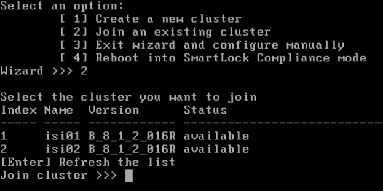
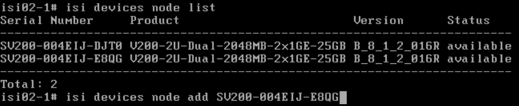
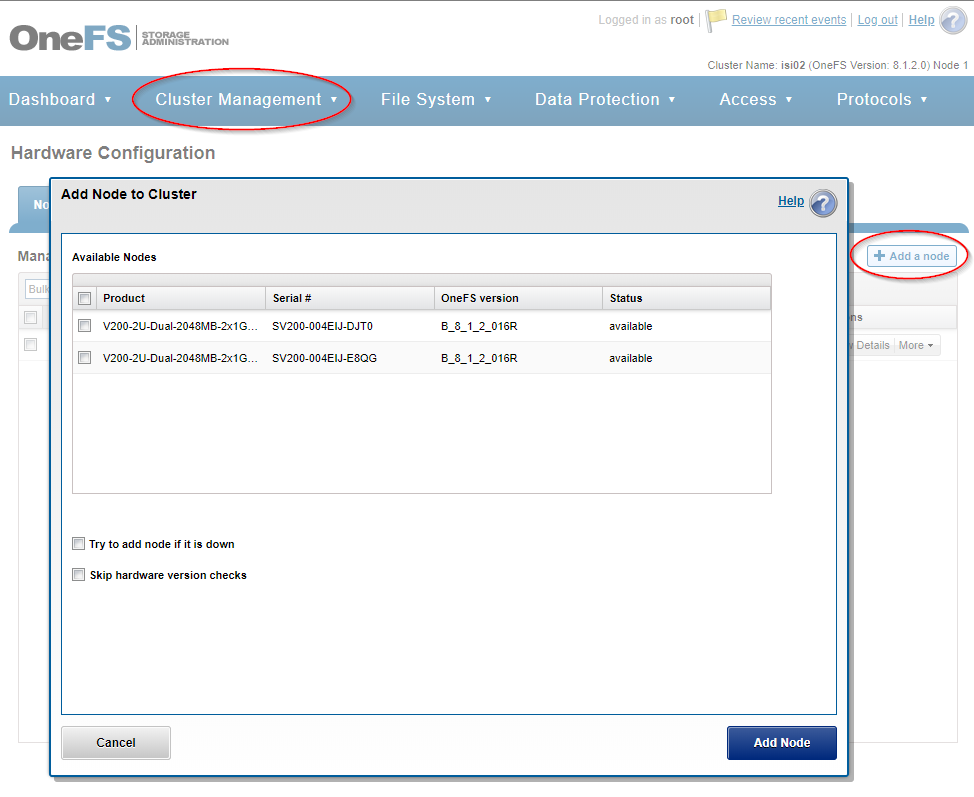

#####
OneFS
#####

Website: https://support.emc.com/products/15209

Intro
=====
OneFS is a `FreeBSD <https://www.freebsd.org/>`_ variant designed by Isilon
Systems and powers a scale-out NAS storage solution. Unlike traditional NAS
appliances, OneFS runs a parallel distributed file system call IFS and uses
`Reed Solomaon <https://en.wikipedia.org/wiki/Reed%E2%80%93Solomon_error_correction>`_
encoding to provide data redundancy and availability instead of hardware-based
`RAID <https://en.wikipedia.org/wiki/RAID>`_.

Getting Started
===============
This section will help you start using OneFS once it's been deployed into
your lab.

Credentials
-----------
The main users in OneFS are ``root`` and ``admin``.

Configuring
-----------
This section will guide you through setting up OneFS for the first time.
The goal of this documentation is to configure OneFS enough to the point that
it can be managed/setup via standard storage-admin paths (i.e. SSH or the WebUI).

.. tip::
  The ``vlab create onefs`` command will automatically configure a new cluster
  for you. To skip the *auto-config*, use the ``--skip-config`` argument when
  deploying new nodes.

Initial system configuration
^^^^^^^^^^^^^^^^^^^^^^^^^^^^
The first step when configuring a new OneFS deployment is connect to the console
and walk through the configuration wizard. When you're done with the wizard, a
new cluster will be formed, and the node you connected to will be *node-1* of
your new cluster.

Here's an image of the OneFS console at the configuration wizard:

Adding a node
^^^^^^^^^^^^^
There are several ways to add a node to a OneFS cluster when the join mode is
set to `manual`.

**From the console of the new node**

You can join a new node directly from the console of that node in 2 easy steps:

1) Select *option 2* from the config wizard
2) Choose the cluster. Valid values are **either** the Index number (left column) or the target cluster's name

**From the CLI of an existing cluster**

You can also join a new node to the OneFS cluster via the OneFS CLI. To do this
you must:

1) List the available nodes with ``isi devices node list``
2) Add the node by serial number with ``isi devices node add <serial number>``

Here's an image of list available nodes, with the syntax to join one of them:

**From the OneFS WebUI**

The OneFS WebUI changes with new releases. As of OneFS 8.1.2, to add a node
you must navigate to: Cluster Management > Hardware Configuration > Add a Node

The below image is the pop-up window you'll see:

.. tip::
   Creating a 3-node cluster takes a lot longer than a single node cluster, and
   most testing/learning with OneFS is identical regardless of node count.
   So save yourself time, and use a 1-node cluster when you can!
