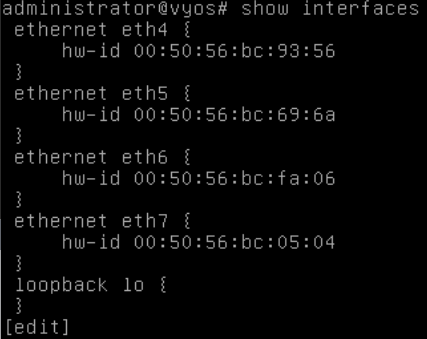

######
Router
######

Website: https://vyos.io

Additional documentation: https://wiki.vyos.net/wiki/User_documentation

Intro
=====
To connect different networks together in your lab, vLab can deploy a network
`router <https://en.wikipedia.org/wiki/Router_(computing)>`_.

Getting Started
===============
In order for packets to be routed, you'll have to configure an IP on the router
so it can act as the default gateway for a given subnet.

Credentials
-----------
The main user for your router is ``administrator``.

.. warning::
   You are not able to make configuration changes as ``root`` even though you
   can login with that account.

Configuring
-----------

The VyOS CLI mimics the Cicso CLI, in that you must explicitly change the operation mode
in order to make any configuration changes. Personally, I find relying on
`tab completion <https://en.wikipedia.org/wiki/Command-line_completion>`_
when using the VyOS CLI makes life significantly easier. You can tell if you're
in a *readonly* or *change config* state by looking at your shell prompt.

When you're in a *readonly* state, your prompt will end with a dollar sign (``$``):

When you're able to make configuration changes, your prompt will end with the pound sign (aka hashtag ``#``).
Here's an example of entering a *config change* state:

Displaying interface info
^^^^^^^^^^^^^^^^^^^^^^^^^
You can display the interface configuration regardless of which operation mode you're
in.

To output general interface information, run the following command:

.. code-block:: shell

   show interfaces

Here's an example of running that command while in *readonly* mode and the output:

Here's an exmaple of that same command, but in *change config* mode:

Assigning IP addresses
^^^^^^^^^^^^^^^^^^^^^^
This section will help you assign an IP to an interface. The IP you assign to
an interface will be the **default gateway of *that* subnet**.

Mapping networks to interfaces
""""""""""""""""""""""""""""""
When you created your router, you were required to supply the networks to connect
to the router. **Order matters**, so the first network supplied will be connected
to the smallest numbered ``eth`` interface. For example,  if you created the router
with the following syntax:

.. code-block:: shell

   $ vlab create router -n testRouter -e frontend -e dmz

Then ``eth4`` would be connected to ``frontend`` and ``eth5`` would be connected to
``dmz``.

Assigning an IP to an interface
"""""""""""""""""""""""""""""""
Once you've entered *change config* mode, the syntax to assign an address is:

.. code-block:: shell

   set interfaces ethernet <iface> address <addr>

Where ``<iface>`` is the name of the network interface (i.e. ``eth5``, ``eth6``, etc)
and ``<addr>`` is the `CIDR format <https://en.wikipedia.org/wiki/Classless_Inter-Domain_Routing>`_
address (ex: ``192.168.5.1/24``).

You must **also** explicitly commit and save changes once they've been set with the ``commit``
and ``save`` commands. If there's a conflicting/invalid configuration change
staged, the ``commit`` command will fail.

Here's an example of assigning ``eth5`` an IP address of ``192.168.57.1`` with
a subnet mask of ``255.255.255.0``:

.. attention::

   Remember to ``commit`` **and** ``save`` configuration changes.

Removing an IP from an interface
""""""""""""""""""""""""""""""""
This processes is nearly identical to assigning an interface. The only difference
is that you *delete* instead of *set* the configuration.

The syntax to remove an address from an interface is:

.. code-block:: shell

   delete interface ethernet <iface> address <addr>

Here is an example of deleting IP ``192.168.6.1`` from interface ``eth6``:

