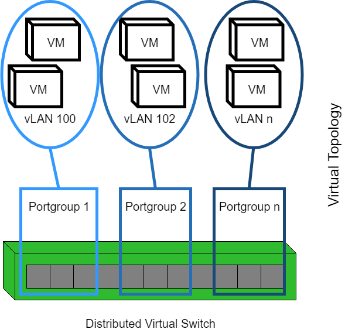
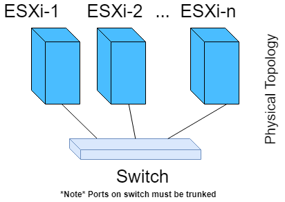

########################
vLab Virtual LAN Service
########################

This service creates virtual networks on their own vLANs. This enables vLab users
to have their own private networks and avoid the hassle of managing IPs for a
group of users.

******
VMware
******

The network created within VMware is a Distributed Virtual Portgroup. In VMware,
the term *"port group"* refers to switch ports; i.e. the thing you plug the cable
into on the network switch. The portgroup is added to a Distributed Virtual Switch (dvSwitch),
which must already configured within vCenter. The portgroup created use VMware's
Virtual Switch vLAN Tagging (VST) to segregate the different networks.

Physical Switch Requirements
============================

The use of VST requires the physical switch for forward the vLAN information to
the ESXi host. In Cisco-speak, you'll have to trunk the physical switch ports.
Specifically, the physical switch ports that connect the NICs on the ESXi hosts
(i.e. the "uplinks") to the dvSwitch, will need to be trunked together.

Network Illustration
====================

The below picture outlines how the vLANs map to a Portgroup and the underlying
dvSwitch in VMware.

In the physical world, the ESXi hosts are connected to the same switch. The
distributed virtual switch runs on all the ESXi hosts. If two VMs on the same
vLAN, but different ESXi hosts need to communicate, the tagged packets route through the physical switch,
to the other ESXi host. This is why the phsycial switch ports must be trunked; in
order to pass long the vLAN information to the *other* ESXi host.

Service Config Values
=====================

Below are the different environment variables that can be configured. These
variables are only ever read when the service starts up for the first time. Therefore,
in order for a value to be updated, you must restart the service.

.. note::

   The vLAN range allocated to this service must be contiguous. If you define a
   minimum value of 10, and a maximum value of 20, this service will assume it can
   use any tag between 10 and 20.

- ``VLAB_URL`` - The URL that clients use to connect to vLab
- ``VLAB_VLAN_ID_MIN`` - The smallest vLAN id that can be used
- ``VLAB_VLAN_ID_MAX`` - The largest vLAN id that can be used
- ``INF_VCENTER_SERVER`` - The IP/FQDN of the vCenter server
- ``INF_VCENTER_USER`` - The name of the user to connect to vCenter as
- ``INF_VCENTER_PASSWORD`` The vCenter user's password
- ``INF_VCENTER_VERIFY_CERT`` - Set to anything to enforce TLS certificate verification. Do no net set if using a self-signed cert.
- ``POSTGRES_PASSWORD`` - **Make sure to set this in production** On initial service deployment, this value to set the password on the database.

Example docker-compose
======================

Here's an example docker-compose file that you can use to test/try out the
vLab vLAN service. Remember to set the VCENTER environment variables, otherwise
all the tasks will fail.

.. note::

   Use a volume with them ``willnx/vlab-vlan-db`` image to persist the database information.
   The location to mount within the container is ``/var/lib/postgresql/data``.

.. code-block:: yaml

    version: '3'
    services:
      vlab-vlan-api:
        image:
          willnx/vlab-vlan-api
        ports:
          - "5000:5000"
        sysctls:
          - net.core.somaxconn=500
      vlab-vlan-db:
        image:
          willnx/vlab-vlan-db
        environment:
          - VLAB_VLAN_ID_MIN=100
          - VLAB_VLAN_ID_MAX=200
          - POSTGRES_PASSWORD=testing
      vlab-vlan-celery:
        image:
          willnx/vlab-vlan-celery
        environment:
          - POSTGRES_PASSWORD=testing
      vlab-vlan-rabbit:
        image:
          rabbitmq:3.7-alpine

*******
The API
*******

The API for this service is all task/job based. When you perform a valid GET, POST, DELETE
call on the ``/api/1/inf/vlan`` end point, the response will contain a ``task-id``.
Use that ``task-id`` to check the status of the request on the ``/api/1/inf/vlan/task``
end point.

All the API end points require a valid `vLab Auth Token <https://github.com/willnx/vlab_auth_service>`_.
The token is used to derive *who you are*. Therefore only you can see or change
the vLANs you own.

Examples
========

All the provided examples use ``asdf.asdf.asdf`` for the auth token, even though
a real token is much longer.

Also, the examples assume you're running the service in a dev/test enviroment.
When running in production, make sure to adjust the URL to use HTTPS, the correct
FQDN of the vLab server, and drop the use of port 5000.

List vLANs you own
------------------

The response object will contain a mapping of the vLAN name to it's vLAN tag id
under the ``content`` key.

Python
^^^^^^

.. code-block:: python

   import time
   import requests
   header = {'X-Auth': 'asdf.asdf.asdf'}
   url = 'http://localhost:5000/api/1/inf/vlan'
   task_id = requests.get(url, headers=header).json()['content']['task-id']
   done = False
   while not done:
     resp = requests.get(url + '/task/{}'.format(task_id), headers=header)
     if resp.status_code == 202:
       # Still processing
       time.sleep(1)
     else:
       done = True
   print(resp.json()['content'], resp.status_code)

Create a new vLAN
-----------------

When a new vLAN is successfully created, there's no content.
If there was a failure, the ``error`` key in the response will provide details.

Python
^^^^^^

.. code-block:: python

   import time
   import requests
   header = {'X-Auth': 'asdf.asdf.asdf'}
   url = 'http://localhost:5000/api/1/inf/vlan'
   body = {'vlan-name' : 'my-new-vlan', 'swtich-name': 'configured-dvswitch'}
   task_id = requests.post(url, headers=header, json=body).json()['content']['task-id']
   while not done:
     resp = requests.get(url + '/task/{}'.format(task_id), headers=header)
     if resp.status_code == 202:
       # Still processing
       time.sleep(1)
     else:
       done = True
   print(resp.json()['content'], resp.status_code)

Delete a vLAN
-------------

When a new vLAN is successfully destroyed, there's no content.
If there was a failure, the ``error`` key in the response will provide details.

Python
^^^^^^

.. code-block:: python

   import time
   import requests
   header = {'X-Auth': 'asdf.asdf.asdf'}
   url = 'http://localhost:5000/api/1/inf/vlan'
   body = {'vlan-name' : 'my-old-vlan'}
   task_id = requests.delete(url, headers=header, json=body).json()['content']['task-id']
   while not done:
     resp = requests.get(url + '/task/{}'.format(task_id), headers=header)
     if resp.status_code == 202:
       # Still processing
       time.sleep(1)
     else:
       done = True
   print(resp.json()['content'], resp.status_code)
