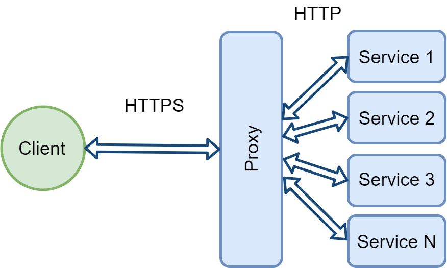
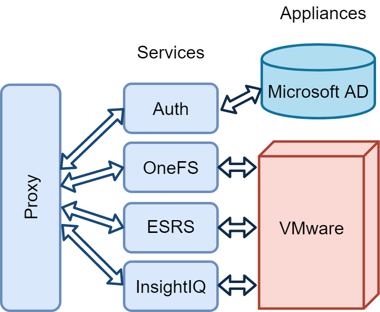

###########
vLab Design
###########

This section goes over the architecture of vLab.

*****
Intro
*****

vLab is an application that sits in between users and a vSphere cluster.
The whole point of abstracting clients from interacting with vSphere is
automation and scalability. When more than a dozen or so users have full access
to vSphere, chaos ensues. People will create things and forget about them, or
accidentally break something belonging to others. In addition, people will do
things slightly different, leading to many different solutions to common needs,
like creating a OneFS cluster. By limiting access, vLab creates more consistency
in the lab, which in turn, makes automation simpler and less error prone.

******
Design
******

The vLab application follows a standard client/server pattern, where the server
is broken up into multiple `microservices <https://microservices.io>`_. Requests
from the clients are routed to the individual services by a reverse proxy. The
below diagram illustrates the general design:

The Server
==========

Most of the services in vLab interact with (for lack of a better word) some sort
of enterprise appliance. The major appliances being a Microsoft AD domain, and
a VMware vSphere cluster. The goal of each service in vLab is to do one thing, and
do it well. This means that multiple different services will interact with the
same appaliance, like VMware as pictured below:

Breaking up every service like this provides some natural
`bulk-heading <https://docs.microsoft.com/en-us/azure/architecture/patterns/bulkhead>`_,
meaning that a bad update to one service wont bring down the entire system. It
also enables each services code base to remain smaller and less complex. The downside
of this approach is increased deployment complexity, and decrease in DRY code.

Every service runs inside Docker container(s). This helps reduce issues with
deployment by reducing the environmental differences between dev, test, and production.
In addition, it makes the server infrastructure less mutable which is great for
security, but harder to debug.
