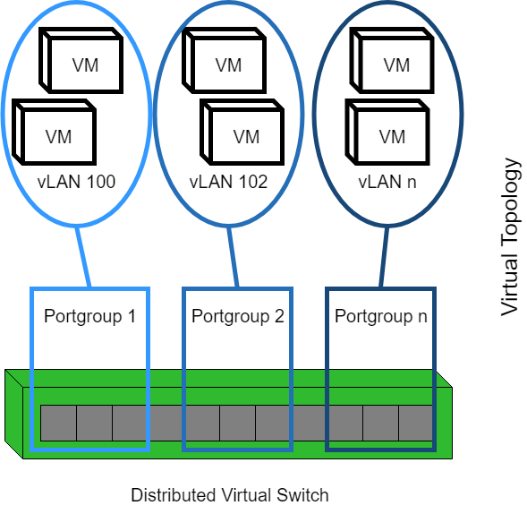
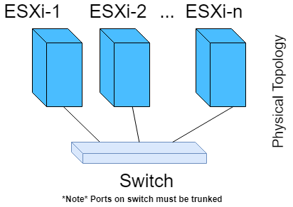

##################
Networking in vLab
##################

This section goes over how networking inside your lab works, and what technology is
used. This documentation assumes you understand the basics of computer networking,
like the
`ISO 7-Layer model <https://en.wikipedia.org/wiki/OSI_model>`_,
`subnets <https://en.wikipedia.org/wiki/Subnetwork>`_,
and
`routing <https://en.wikipedia.org/wiki/Routing>`_.

******************
What it looks like
******************

TL;DR
=====

- DefaultGateway IP: ``192.168.1.1``
- Default Subnet   : ``255.255.255.0``

User's networks in vLab are segregated, meaning that only you have access to the
networks owned by you. Even though all users are accessing the same vSphere
environment, all the networks within a lab are broken out into individual
`VLANs <https://en.wikipedia.org/wiki/Virtual_LAN>`_.

The diagram below illustrates two different labs with multiple vLANs:

.. image:: network_diagram.png

In this image, VLANs of the same color belong to the same owner. The default gateway
(displayed as a wall) setups up a `NAT <https://en.wikipedia.org/wiki/Network_address_translation>`_
between the public network, and your lab.
The public IP of your network is obtained via DHCP. The private IP (aka, the
default gateway machines in your lab use) is automatically configured to ``192.168.1.1``.

The NAT plus VLAN approach enables you to choose whatever IPs you want within your
lab's network! There's no chance of IP collision with another lab, and no
IPv6 nightmares due to legacy infrastructure. But nothing in life is free (even
if you don't pay with money), and this networking freedom inside a lab comes at the
cost of routing between resources in and outside of a lab. Routing into a network
behind a NAT is typically the harder part, and a lot of work has been
put into vLab to make `port-forwarding <https://en.wikipedia.org/wiki/Port_forwarding>`_
easy to simplify that (i.e. the :ref:`vlab-ipam` service).

However, this requires you to route
to the default gateway in order to connect to *outside* resources. This also means
that to have an *outside* resource access your lab, you must configure
`port-forwarding <https://en.wikipedia.org/wiki/Port_forwarding>`_
rule(s).

To make networking simpler within your lab, the default gateway also runs a
`DHCP <https://en.wikipedia.org/wiki/Dynamic_Host_Configuration_Protocol>`_
server. Machines deployed into your lab will automatically have their network
configured if they do not require static IP assignment. The default range of IPs
handed out by the DHCP server is ``192.168.1.150`` to ``192.168.1.254``, and like
most things in vLab, you can change this.

If you create additional networks, you can connect them with routers. The routers
use the Link-state protocol to move packets between different networks by default,
but you can configure the routers to use any standard protocol.

**************
Under the hood
**************

The network created within VMware is a Distributed Virtual Portgroup. In VMware,
the term *"port group"* refers to switch ports; i.e. the thing you plug the cable
into on the network switch. The portgroup is added to a Distributed Virtual Switch (dvSwitch),
which must already configured within vCenter. The portgroup created use VMware's
Virtual Switch vLAN Tagging (VST) to segregate the different networks.

Physical Switch Requirements
============================

The use of VST requires the physical switch for forward the vLAN information to
the ESXi host. In Cisco-speak, you'll have to trunk the physical switch ports.
Specifically, the physical switch ports that connect the NICs on the ESXi hosts
(i.e. the "uplinks") to the dvSwitch, will need to be trunked together.

Network Illustration
====================

The below picture outlines how the vLANs map to a Portgroup and the underlying
dvSwitch in VMware.

In the physical world, the ESXi hosts are connected to the same switch. The
distributed virtual switch runs on all the ESXi hosts. If two VMs on the same
vLAN, but different ESXi hosts need to communicate, the tagged packets route through the physical switch,
to the other ESXi host. This is why the phsycial switch ports must be trunked; in
order to pass long the vLAN information to the *other* ESXi host.

